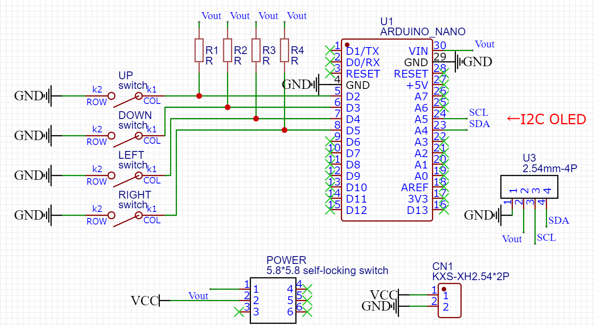
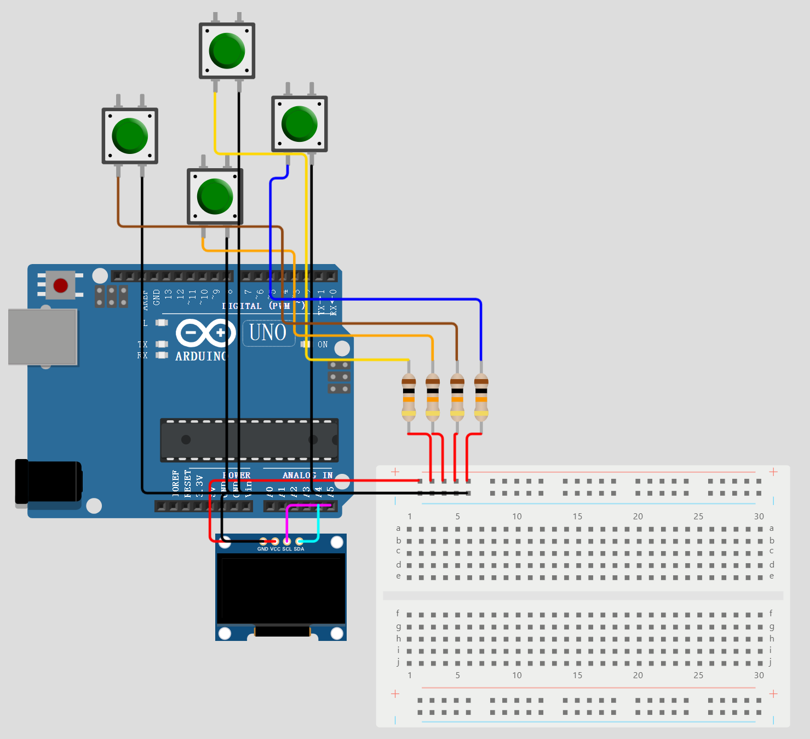
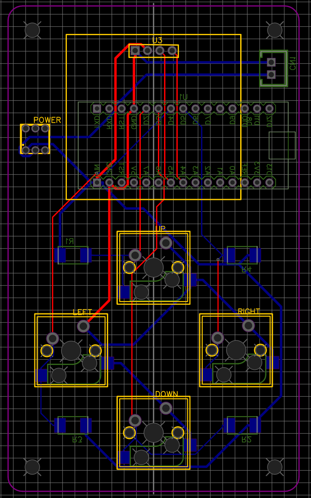
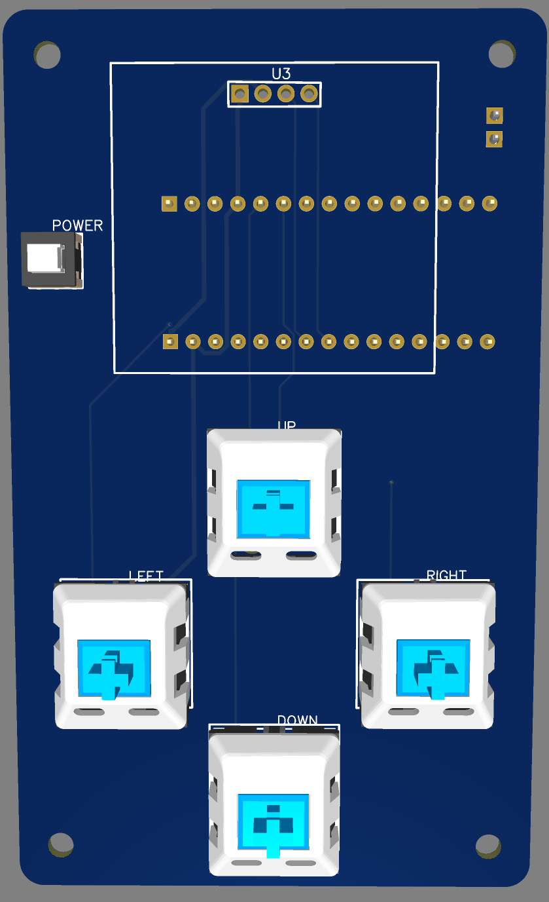
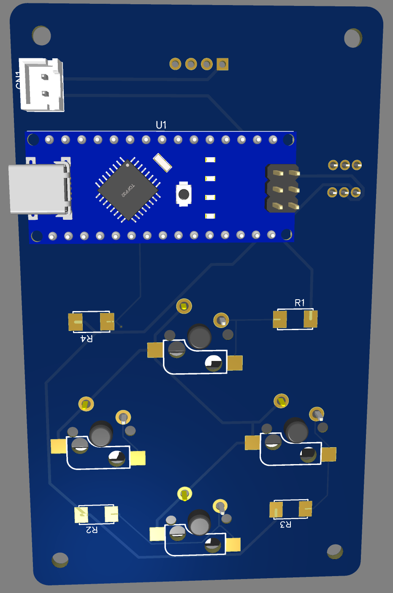

# Nokia Snake Game based on Arduino Nano

*** This is a guide of a simple project for beginners - Snake game, there's no complex signal processing or wiring, wish you have fun with this project! **

Author: Simon Lin Zhou

## Online Simulator URL:
https://wokwi.com/projects/405484881560669185
## Component List

These are the necessary components of a complete system. If you are just testing code or for fun, you can also only use an Arduino board, four buttons and an OLED screen, but by this way you can only power your device by USB cable.

| name                                                         | amount |
| ------------------------------------------------------------ | ------ |
| Arduino Nano Board                                           | 1      |
| any kind of keyboard switch                                  | 4      |
| keyboard hat(arrow key)                                      | 4      |
| I2C 128*64 OLED module (1.3inch)                             | 1      |
| 10kΩ 2515 SMD Resistor(can be much smaller, I choose this big one only for easier ironing) | 4      |
| 2pin XH2.54 socket                                           | 1      |
| 5V Battery with 2pin XH2.54 output and Type-C input          | 1      |
| 5.8*5.8 self-locking switch                                  | 1      |
| M3*30 Brass Standoff                                         | 4      |
| M3 Screw                                                     | 8      |

## Wiring

The Wiring of this project is very simple. All you need to do is connect four low active button with pull up resistor, and one I2C OLED screen to Arduino Nano. 

The screen we use is an I2C OLED screen, so we have to connect the SDA and SCL pin to A4 and A5. But for buttons, you can connect them to any GPIO pin you want.

Here is the SCH:

As you can see, there's a self-locking switch and an XH2.54 socket. These are designed for battery using(connecting battery and board by XH2.54 connector, and turning device on/off by pressing self-locking switch). If you only want to use USB cable for powering, you can ignore these two components, and replace all the `Vout` by `VCC`.

Connection(Resistors are all 10kΩ):
***Notice: Port 2, 3, 4, 5 are each both connected to pull up resistor and button pin**

## PCB design

***This part is for those who can't be satisfied with only wiring or hate these cables messing around.**

You can give the Gerber file to the manufacturer for PCB production. I won't explain too much about PCB designing on this project. If you are interested in it, you can learn using Altium Designer. It's very easy with the SCH given or you already have the ability to draw SCH by yourself.

The given PCB design and 3D preview:

After Ironing the components onto the PCB, you can connect the board to a shell by M3 screw. The Shell can be a 3D printed model, or just acrylic board with brass standing.

## Program(Optional)

The program of this project is a little complex. But don't be worry, I will explain the code block by block. (You can preview the code in online simulator)
### Initializing

We use `Adafruit_SSD1306.h` to drive OLED screen. You can download it in Arduino IDE's Library Manager.

~~~c++
#include <Wire.h>
#include <Adafruit_GFX.h>	
//you have to include these two libraries before including Adafruit_SSD1306.h
#include <Adafruit_SSD1306.h>
 
#define SCREEN_WIDTH 128 // Width pixel
#define SCREEN_HEIGHT 64 // Height pixel
//reset pin, necessary for Adafruit_SSD1306 library
#define OLED_RESET 6
//Key Pin (you can change it to your own connected button pin)
#define KEY_UP_PIN 2
#define KEY_DOWN_PIN 3
#define KEY_LEFT_PIN 4
#define KEY_RIGHT_PIN 5
//Key Status (Low Active)
#define KEY_NULL 4
#define KEY_UP 0
#define KEY_DOWN 1
#define KEY_LEFT 2
#define KEY_RIGHT 3
//Screen Status
#define SCREEN_GAMEOVER 2
#define SCREEN_MAINMENU 0
#define SCREEN_INGAME 1
#define SNAKE_LENGTH_MAX 127
~~~
I created the variable of saving snake's head position and the rest of the body separately, because there will be more algorithm related with head than body.

Also there's two variables represents key pressing status. This is for detecting whether the key is pressed right now, or have been pressed for a while.

~~~C++
//instantiation
Adafruit_SSD1306 screen(SCREEN_WIDTH, SCREEN_HEIGHT, &Wire, OLED_RESET); 
uint8_t snakeX[SNAKE_LENGTH_MAX];
uint8_t snakeY[SNAKE_LENGTH_MAX];
uint8_t snakeXHead = 50;
uint8_t snakeYHead = 39;
uint8_t foodPos[2];	//the location of the ramdomly spawned food
uint8_t snakeLength = 4;
uint8_t currentDirection = KEY_RIGHT;	//how snake moves
bool isFrozen = false;  //when dead, let player have a chance to take a glance at the last scenary
uint8_t speed = 5;  //how fast the snake run
int score = 0;  
uint8_t currentScreen = SCREEN_MAINMENU;
uint8_t currentKey = KEY_NULL;
uint8_t lastKey = KEY_NULL; //the key state of last loop
~~~

### Setup

When setup, except for the hardware initializing, we also have to initialize the snake itself. We spawn the snake at a fixed location, and generate a food at a random location.

We will talk about the `foodGenerate()`later. 

~~~c++
void setup() {
  // put your setup code here, to run once:
  Serial.begin(115200);
  //MsTimer2::set(20, keyHandler); 
  //MsTimer2::start();  // enables the interrupt.
  pinMode(KEY_UP_PIN, INPUT);
  pinMode(KEY_DOWN_PIN, INPUT);
  pinMode(KEY_LEFT_PIN, INPUT);
  pinMode(KEY_RIGHT_PIN, INPUT);
  screen.begin(SSD1306_SWITCHCAPVCC, 0x3C);
  screen.setTextColor(WHITE);
  randomSeed(analogRead(A0)); //for food generating
  foodGenerate();
  for(int i=4;i<SNAKE_LENGTH_MAX;i++) 
  {
    snakeX[i] = 0;
    snakeY[i] = 0;
  }
  for(int i=0;i<4;i++) snakeY[i] = 39;
  snakeX[0] = 48;
  snakeX[1] = 46;
  snakeX[2] = 44;
  snakeX[3] = 42;
}
~~~

### Key Detection

There's two way to detect the key, whether is the moment of being pressed or is just pressed no matter it's pressed at this moment or have been pressed for a while. For speed adjusting in the main menu, we expect the moment of left/right button being pressed to trigger the speed increase/decrease. And the direction changing in game, we can just use the latter way, because the key represents the direction directly.

So we need a variable indicating which key is pressed currently, and another variable indicating how the last loop detected, to determine whether the button is just pressed at this moment.

Detecting function:

~~~c++
void keyHandler()
{
  if(!digitalRead(KEY_LEFT_PIN)) currentKey = KEY_LEFT;
  else if(!digitalRead(KEY_RIGHT_PIN)) currentKey = KEY_RIGHT;
  else if(!digitalRead(KEY_UP_PIN)) currentKey = KEY_UP;
  else if(!digitalRead(KEY_DOWN_PIN)) currentKey = KEY_DOWN;
  else currentKey = KEY_NULL;
}
~~~

In the main menu section, left/right button is for speed adjusting, and up/down button is for starting the game. 

~~~c++
void keyMainMenuHandler()
{
  if( (currentKey == KEY_UP && lastKey != KEY_UP) || (currentKey == KEY_DOWN && lastKey != KEY_DOWN)) currentScreen = SCREEN_INGAME;
  if(currentKey == KEY_LEFT && lastKey != KEY_LEFT)
    if(speed>1) speed -= 1;
  if(currentKey == KEY_RIGHT && lastKey != KEY_RIGHT)
    if(speed<9) speed += 1;
}
~~~

In the game over section, any button being pressed can lead to the main menu section, so it's very simple.

~~~c++
void keyGameOverHandler()
{
  if(currentKey != KEY_NULL) currentScreen = SCREEN_MAINMENU;
}
~~~

In the in game section, things get complicated.

I mentioned a variable in the setup section - `isFrozen`, which indicates whether the snake is dead now, and let the player look at how he died until any key is pressed. And if the key is pressed, the game have to be initialized again.

On the other hand, if the snake haven't dead yet, the key changes the snake's moving direction. An important thing have to be mentioned is , the snake can't be turned around directly, which means when a snake is currently moving right, when you press left button, it can't turn to the left direction immediately, you have to make the snake turn up/down first, vice versa.

~~~c++
void keyInGameHandler()
{
  if(isFrozen)
  {
    if(currentKey != KEY_NULL && lastKey == KEY_NULL)
    {
      currentScreen = SCREEN_GAMEOVER;
      isFrozen = false;
      snakeXHead = 50;
      snakeYHead = 39;
      snakeLength = 4;
      currentDirection = KEY_RIGHT;
      for(int i=4;i<SNAKE_LENGTH_MAX;i++) 
      {
        snakeX[i] = 0;
        snakeY[i] = 0;
      }
      for(int i=0;i<4;i++) snakeY[i] = 50;
      snakeX[0] = 48;
      snakeX[1] = 46;
      snakeX[2] = 44;
      snakeX[3] = 42;
      foodGenerate();
    } 
  }
  else
  {
    if (currentDirection == KEY_RIGHT || currentDirection == KEY_LEFT)
      if(currentKey == KEY_UP)  currentDirection = KEY_UP;
      if(currentKey == KEY_DOWN) currentDirection = KEY_DOWN;
    if (currentDirection == KEY_UP || currentDirection == KEY_DOWN)
      if(currentKey == KEY_LEFT)  currentDirection = KEY_LEFT;
      if(currentKey == KEY_RIGHT) currentDirection = KEY_RIGHT;
  }
}
~~~

### In Game Function

May be it's the most complicated part of the whole program. First, there have to be a function to handle the rest of the body movement. We simply let all the element of the list replace the latter element, and let `snakeX[0]` and `snakeY[0]` equals `snakeXHead` and `snakeYHead`.Secondly, we handle the snake head movement. There's a variable represents the current direction of snake moving as I mentioned before. So we let the snake's X/Y axis increase/decrease by 2 pixel depend on current direction. After the movement function, there will be two detecting functions - whether the food is eaten or whether the snake is dead. These two functions are quite easy. All you need is judging the equality of coordination.

~~~c++
void inGameAlgorithm()
{
  if(!isFrozen)
  {
    //handle snake movement
    for(int i=snakeLength;i>0;i--)
    {
      snakeX[i] = snakeX[i-1];
      snakeY[i] = snakeY[i-1];
    }
    snakeX[0] = snakeXHead;
    snakeY[0] = snakeYHead;
    if(currentDirection == KEY_RIGHT) snakeXHead += 2;
    else if(currentDirection == KEY_LEFT) snakeXHead -= 2;
    else if(currentDirection == KEY_UP) snakeYHead -= 2;
    else if(currentDirection == KEY_DOWN) snakeYHead += 2;
    //handle if eat food
    if(snakeXHead == foodPos[0] && snakeYHead == foodPos[1])
    {
      score += speed;
      snakeLength += 1;
      foodGenerate();
    }
    //handle if dead (out of range / eat itself)
    if(snakeXHead < 0 || snakeXHead > 127 || snakeYHead < 11 || snakeYHead > 63)
      isFrozen = true;
    for(int i=0;i<snakeLength;i++)
      if(snakeXHead == snakeX[i] && snakeYHead == snakeY[i])
      {
        isFrozen = true;
        break;
      }
  }
}
~~~

### Display

The total game uses three different screens, which is Game Over screen, Main Menu screen and In Game screen. So we separate the display to three parts, each represents a kind of screen.

I designed a title bar on the top of the screen, which is always shown, so I wrote a function to drive the common part.

~~~c++
void commonDisplay()
{
  screen.clearDisplay();
  screen.setTextSize(1);
  screen.setCursor(0, 0);
  screen.print("Nano Snake");
  screen.drawLine(0,10,128,10,SSD1306_WHITE);
}
~~~

 Then is main menu and game over section, which is quite easy because you can read directly from the code.

~~~c++
void displayMainMenu()
{
  commonDisplay();
  screen.setCursor(0, 55);
  screen.print("  UP / DOWN TO START ");
  screen.setCursor(49, 14);
  screen.print("SPEED");
  screen.setTextSize(2);
  screen.setCursor(0, 30);
  screen.print("<");
  screen.setCursor(58, 30);
  screen.print(speed);
  screen.setCursor(116, 30);
  screen.print(">");
  screen.display();
}
void displayGameOver()
{
  commonDisplay();
  screen.setTextSize(2);
  screen.setCursor(16, 20);
  screen.print("GAMEOVER");
  screen.setCursor(4, 50);
  screen.print("SCORE:");
  screen.print(score);
  screen.display();
}
~~~

There are three parts of the in game display. Snake itself, food and score.

~~~c++
void displayInGame()
{
  if(!isFrozen)
  {
    commonDisplay();
    screen.setCursor(104, 0);
    screen.print(score);
    for(int i=0;i<snakeLength;i++)
      screen.drawRect(snakeX[i], snakeY[i], 2, 2, SSD1306_WHITE);
    screen.drawRect(snakeXHead, snakeYHead, 2, 2, SSD1306_WHITE);
    screen.drawRect(foodPos[0], foodPos[1], 2, 2, SSD1306_WHITE);
    screen.display();
  }
}
~~~

### Main Loop function

The process is:

1. Key detecting
2. If in game, than run in game algorithm
3. Displaying
4. Replace `lastKey` value with `currentKey` value
5. Delaying, the time depends on current speed.

~~~c++
void loop() {
  // put your main code here, to run repeatedly:
  keyHandler();
  Serial.println(currentKey);
  if(currentScreen == SCREEN_MAINMENU)
  {
    score = 0;
    keyMainMenuHandler();
    displayMainMenu();
  }
  else if(currentScreen == SCREEN_GAMEOVER)
  {
    keyGameOverHandler();
    displayGameOver();
  }
  else if(currentScreen == SCREEN_INGAME)
  {
    keyInGameHandler();
    inGameAlgorithm();
    displayInGame();
  }

  switch(speed)
  {
    case 1:
      delay(150);
      break;
    case 2:
      delay(130);
      break;
    case 3:
      delay(110);
      break;
    case 4:
      delay(90);
      break;
    case 5:
      delay(70);
      break;
    case 6:
      delay(50);
      break;
    case 7:
      delay(40);
      break;
    case 8:
      delay(30);
      break;
    case 9:
      delay(20);
      break;
  }
  lastKey = currentKey;
}
~~~

## Addons

You can add some new features you want, like an LED showing the state of gaming, a wheel or something to adjust the screen light, or some map instead of the total blank in game, etc

Have fun!
